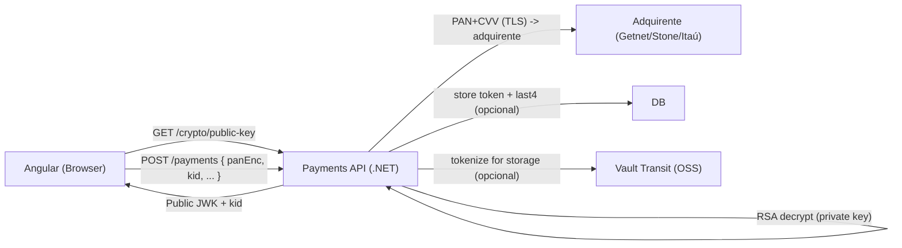

# Exemplo – 2 Endpoints para Criptografia no Front-end (Angular) e Decriptação no Back-end (.NET) para Envio ao Adquirente

> **Resumo:** este documento exemplifica um padrão com **2 endpoints**:
>
> 1) `GET /crypto/public-key` → o backend fornece **chave pública** (JWK) + `kid`  
> 2) `POST /payments` → o front envia **PAN criptografado** (`panEnc`) + `kid` e o backend **descriptografa** e envia ao **adquirente** (ex.: Getnet)
>
> ✅ **Importante:** **não existe “chave privada” no front-end**. O front usa apenas **chave pública**.  
> ⚠️ **PCI:** isso adiciona uma camada extra além do TLS, mas **não reduz escopo PCI** se seu backend ainda vê PAN (ele vai descriptografar).

---

## Arquitetura (Mermaid)



---

## Contratos HTTP (exemplo)

### 1) `GET /crypto/public-key`

**Response**
```json
{
  "kid": "k1-2026-01",
  "jwk": {
    "kty": "RSA",
    "alg": "RSA-OAEP-256",
    "use": "enc",
    "kid": "k1-2026-01",
    "n": "....",
    "e": "AQAB"
  }
}
```

### 2) `POST /payments`

**Request**
```json
{
  "amount": 150.00,
  "currency": "BRL",
  "kid": "k1-2026-01",
  "panEnc": "BASE64_RSA_CIPHERTEXT==",
  "cardExpMonth": 12,
  "cardExpYear": 2028,
  "cvv": "123"
}
```

**Response**
```json
{
  "status": "APPROVED",
  "tid": "TID_EXEMPLO"
}
```

---

## Backend (.NET / ASP.NET Core) – Implementação

### 1) Provider de chaves (exemplo didático)
> Em produção, **não guarde PEM no repo**. Prefira: Vault KV, Azure Key Vault, HSM, secret manager.

```csharp
using System.Security.Cryptography;

public interface IKeyProvider
{
    (string Kid, RSA PublicRsa) GetCurrentPublicKey();
    RSA GetPrivateKeyByKid(string kid);
}

public sealed class FilePemKeyProvider : IKeyProvider
{
    private readonly string _kid = "k1-2026-01";
    private readonly RSA _privateRsa;
    private readonly RSA _publicRsa;

    public FilePemKeyProvider(string privatePemPath)
    {
        var privatePem = File.ReadAllText(privatePemPath);

        _privateRsa = RSA.Create();
        _privateRsa.ImportFromPem(privatePem);

        _publicRsa = RSA.Create();
        _publicRsa.ImportParameters(_privateRsa.ExportParameters(false));
    }

    public (string Kid, RSA PublicRsa) GetCurrentPublicKey() => (_kid, _publicRsa);

    public RSA GetPrivateKeyByKid(string kid)
    {
        if (kid != _kid) throw new SecurityException("kid inválido ou expirado");
        return _privateRsa;
    }
}
```

### 2) `GET /crypto/public-key` – retorna JWK público + `kid`
```csharp
using Microsoft.AspNetCore.Mvc;
using System.Security.Cryptography;

[ApiController]
[Route("crypto")]
public sealed class CryptoController : ControllerBase
{
    private readonly IKeyProvider _keys;
    public CryptoController(IKeyProvider keys) => _keys = keys;

    [HttpGet("public-key")]
    public IActionResult GetPublicKey()
    {
        var (kid, rsa) = _keys.GetCurrentPublicKey();
        var p = rsa.ExportParameters(false);

        var jwk = new
        {
            kty = "RSA",
            alg = "RSA-OAEP-256",
            use = "enc",
            kid,
            n = Base64Url(p.Modulus!),
            e = Base64Url(p.Exponent!)
        };

        return Ok(new { kid, jwk });
    }

    private static string Base64Url(byte[] bytes) =>
        Convert.ToBase64String(bytes).TrimEnd('=').Replace('+', '-').Replace('/', '_');
}
```

### 3) `POST /payments` – decripta `panEnc` e chama adquirente (adapter)
```csharp
using Microsoft.AspNetCore.Mvc;
using System.Security.Cryptography;
using System.Text;

public sealed record CreatePaymentEncryptedRequest(
    decimal Amount,
    string Currency,
    string Kid,
    string PanEnc,     // base64 ciphertext RSA
    int CardExpMonth,
    int CardExpYear,
    string Cvv
);

[ApiController]
[Route("payments")]
public sealed class PaymentsController : ControllerBase
{
    private readonly IKeyProvider _keys;
    private readonly IAcquirerClient _acquirer;

    public PaymentsController(IKeyProvider keys, IAcquirerClient acquirer)
    {
        _keys = keys;
        _acquirer = acquirer;
    }

    [HttpPost]
    public async Task<IActionResult> Pay([FromBody] CreatePaymentEncryptedRequest req, CancellationToken ct)
    {
        // 1) chave privada por kid
        var rsa = _keys.GetPrivateKeyByKid(req.Kid);

        // 2) decrypt PAN
        var panBytes = rsa.Decrypt(Convert.FromBase64String(req.PanEnc), RSAEncryptionPadding.OaepSHA256);
        var pan = Encoding.UTF8.GetString(panBytes);

        // 3) chama adquirente (Getnet/Stone/Itaú via adapter)
        var result = await _acquirer.AuthorizeAsync(new AuthorizeCardPayment(
            Amount: req.Amount,
            Currency: req.Currency,
            Pan: pan,
            ExpMonth: req.CardExpMonth,
            ExpYear: req.CardExpYear,
            Cvv: req.Cvv
        ));

        // 4) nunca persista CVV; limpe referência do PAN
        pan = string.Empty;

        return Ok(new { status = result.Approved ? "APPROVED" : "DECLINED", tid = result.Tid });
    }
}
```

### 4) Adapter do adquirente (esqueleto)
```csharp
public sealed record AuthorizeCardPayment(
    decimal Amount,
    string Currency,
    string Pan,
    int ExpMonth,
    int ExpYear,
    string Cvv
);

public sealed record AcquirerAuthResult(bool Approved, string Tid);

public interface IAcquirerClient
{
    Task<AcquirerAuthResult> AuthorizeAsync(AuthorizeCardPayment req);
}
```

---

## Front-end (Angular) – WebCrypto RSA-OAEP

### 1) Service: buscar chave pública e criptografar o PAN
```ts
import { HttpClient } from '@angular/common/http';
import { Injectable } from '@angular/core';

@Injectable({ providedIn: 'root' })
export class CryptoService {
  constructor(private http: HttpClient) {}

  async getPublicKey(): Promise<{ kid: string; jwk: JsonWebKey }> {
    const res: any = await this.http.get('/api/crypto/public-key').toPromise();
    return { kid: res.kid, jwk: res.jwk };
  }

  async encryptPan(pan: string): Promise<{ kid: string; panEncB64: string }> {
    const { kid, jwk } = await this.getPublicKey();

    const key = await window.crypto.subtle.importKey(
      'jwk',
      jwk,
      { name: 'RSA-OAEP', hash: 'SHA-256' },
      false,
      ['encrypt']
    );

    const data = new TextEncoder().encode(pan);
    const encrypted = await window.crypto.subtle.encrypt({ name: 'RSA-OAEP' }, key, data);

    return { kid, panEncB64: this.arrayBufferToBase64(encrypted) };
  }

  private arrayBufferToBase64(buf: ArrayBuffer): string {
    const bytes = new Uint8Array(buf);
    let binary = '';
    bytes.forEach((b) => (binary += String.fromCharCode(b)));
    return btoa(binary);
  }
}
```

### 2) Checkout: enviar pagamento com PAN criptografado
```ts
import { Component } from '@angular/core';
import { HttpClient } from '@angular/common/http';
import { CryptoService } from './crypto.service';

@Component({
  selector: 'app-checkout',
  template: `<button (click)="pay()">Pagar</button>`
})
export class CheckoutComponent {
  pan = '4111111111111111';
  expMonth = 12;
  expYear = 2028;
  cvv = '123';
  amount = 150.00;

  constructor(private crypto: CryptoService, private http: HttpClient) {}

  async pay() {
    const { kid, panEncB64 } = await this.crypto.encryptPan(this.pan);

    this.http.post('/api/payments', {
      amount: this.amount,
      currency: 'BRL',
      kid,
      panEnc: panEncB64,
      cardExpMonth: this.expMonth,
      cardExpYear: this.expYear,
      cvv: this.cvv
    }).subscribe(console.log);
  }
}
```

---

## Boas práticas importantes (pagamentos + PCI)

- **Nunca** mande “chave privada” ao front.
- Use **TLS** sempre, mesmo com criptografia de payload.
- Rotacione chaves com `kid` e mantenha “n-1” por um tempo.
- Não logar PAN/CVV. **Nunca** persistir CVV.
- Se for armazenar referência do cartão: prefira **tokenização (Vault/PSP)** e guarde `last4`.
- Para reduzir escopo PCI de verdade: tokenizar antes do seu backend ver o PAN (ex.: Vault/PSP/BFF com Vault Transit).

---

## Teste rápido (cURL)

### Obter public key
```bash
curl -sS https://seu-host/api/crypto/public-key
```

> Para criptografar com RSA-OAEP via CLI é mais trabalhoso (OpenSSL + padding OAEP).  
> O caminho mais simples é testar via Angular (WebCrypto) ou um pequeno console app .NET.
