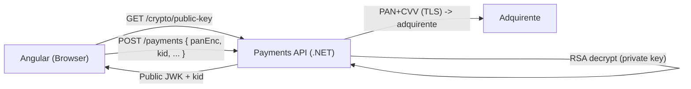
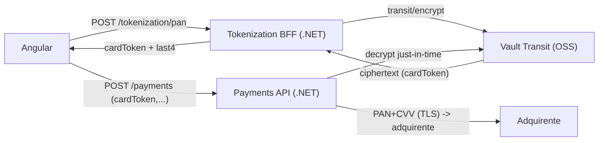

# Plano de melhorias (Swagger Payments DB) – Prioridade PCI DSS 4.0

> **Como usar este documento:** ele pega os pontos que discutimos a partir do Swagger de pagamentos (e padrões comuns observados em APIs desse tipo) e organiza em:
>
> - **Críticos (P0)**: tendem a **bloquear certificação PCI** ou representar alto risco de incidente.
> - **Bloco de melhorias não críticas (P1/P2)**: aumentam robustez, qualidade e segurança, mas normalmente **não são o “stop-the-line”** do PCI (ainda assim são recomendadas).
>
> **Nota:** alguns itens dependem de confirmação no Swagger/código (ex.: existência de `request/response/raw`, campos de cartão, etc.). Onde aplicável, eu citei “**se existir**”.

---

## 1) Críticos (P0) – Bloqueiam PCI / risco altíssimo

### P0.1 – PAN/CVV indo “direto” para o backend (CDE explode)
**Sintoma (Swagger/código):**
- Request de pagamento com campos como `cardNumber`, `pan`, `cvv`, `securityCode`, ou similares **chegando no backend**.
- Possibilidade de “raw payload” trafegar e ficar em logs/telemetria.

**Por que é crítico:**
- CVV **não pode** ser armazenado após autorização (nem criptografado).
- Receber PAN em claro no backend aumenta muito o **escopo PCI** e o risco de vazamento acidental (logs, APM, dumps, etc.).

**Solução recomendada (do desenho que fizemos):**
- **2 endpoints**: backend publica **chave pública** (`GET /crypto/public-key`) e o front envia **PAN criptografado** (`POST /payments` com `panEnc` + `kid`).  
- Backend **descriptografa** com chave privada e envia ao adquirente.

✅ **Benefício:** reduz chance de PAN “aparecer” em camadas intermediárias e logs acidentais.  
⚠️ **Observação PCI:** isso **não tira o backend do escopo PCI** (ele ainda vê PAN), mas é uma melhoria forte de hardening.

#### Ação técnica (implantação rápida)
- Criar endpoint `GET /crypto/public-key` retornando JWK + `kid`.
- No Angular, usar WebCrypto (RSA-OAEP-256) para criptografar PAN.
- Alterar o contrato `POST /payments` para receber `panEnc` (base64) + `kid` (em vez de `cardNumber`).
- No backend, descriptografar **só no momento de chamar adquirente** e **nunca logar** o valor.

📄 **MD de referência com código (Angular + .NET + Mermaid):** `pci-crypto-front-back.md`

---

### P0.2 – Campos/flags de logging no contrato (ex.: `gravarLog`, `raw`, `request`, `response`)
**Sintoma (Swagger):**
- Modelos contendo `gravarLog` ou retorno de objetos com `raw/request/response`.
- Endpoints que retornam request/response de transação para o cliente.

**Por que é crítico:**
- Isso costuma levar a **persistência involuntária** de PAN/CVV em logs e storage.
- “Raw payloads” viram vazamento em incidentes e são uma bomba para PCI.

**Solução:**
- Remover do contrato público qualquer campo/flag que controle logs.
- Se existir necessidade de debug: logging **interno**, com **redação/masking** (first6/last4) e **remoção completa** de CVV.

#### Ação técnica
- DTOs: remover `raw/request/response/gravarLog` de requests/responses.
- Implementar redator de logs (masking de PAN).
- Garantir que APM/telemetria (Application Insights, Datadog etc.) **não capture body** de requests de pagamento.

---

### P0.3 – Retorno/exposição de dados sensíveis nas respostas
**Sintoma:**
- Response devolvendo PAN completo, token reversível sem controle, ou estruturas que incluem dados sensíveis.

**Por que é crítico:**
- “Excessive Data Exposure” (OWASP API) + não conformidade PCI.

**Solução:**
- Respostas de pagamento devem retornar apenas:
  - `status`, `paymentId`, `tid`, `last4`, `brand` (se aplicável)
  - **Nunca** PAN completo; **nunca** CVV; **nunca** payload raw.

---

### P0.4 – Falta de autorização contextual (BOLA: Broken Object Level Authorization)
**Sintoma (Swagger/código):**
- `GET /payments/{id}` ou `POST /payments/{id}/cancel` sem validação de pertencimento ao `merchantId` do token.
- Não fica claro no contrato como o `merchantId` é aplicado.

**Por que é crítico:**
- Permite leitura/cancelamento de transações de outros lojistas → vazamento, fraude e incidente reportável.

**Solução:**
- Sempre validar: o recurso `{id}` pertence ao `merchantId` do JWT/credencial.
- Retornar `403` quando não pertence.

---

### P0.5 – Swagger aberto em ambiente exposto
**Sintoma:**
- Swagger UI acessível sem auth em ambientes públicos (staging/prod).

**Por que é crítico:**
- Ajuda atacante a enumerar endpoints e modelos.

**Solução:**
- Desabilitar Swagger em produção ou proteger com:
  - autenticação + allowlist de IP + WAF.

---

## 2) Solução crítica consolidada (P0) – Fluxo recomendado

### Opção A (mais rápida): Criptografia de payload no front (Angular) + decrypt no backend

### Opção B (mais completa para minimizar exposição): Tokenização + detokenize just-in-time
> Se você já está usando Vault/Transit (OSS), o “token” pode ser o **ciphertext**.

---

## 3) Bloco de melhorias possíveis (não críticas) – P1 / P2

### P1.1 – Idempotência (evitar cobrança duplicada)
- Adotar `Idempotency-Key` obrigatório em `POST /payments`/`capture`/`refund`.
- Armazenar resposta por chave (Redis/DB) com TTL (ex.: 24h).

### P1.2 – Valores monetários como `decimal` (não `double`)
- Corrigir todos os modelos/DTOs e cálculos financeiros para `decimal`.

### P1.3 – Verbos HTTP corretos
- `GET` apenas leitura (sem side effects).
- `POST` para captura/cancelamento/refund (ou `PUT` idempotente, se aplicável).

### P1.4 – Padronizar erros e status HTTP
- Documentar `400/401/403/404/409/422/500` com schema consistente:
  - `code`, `message`, `details`, `correlationId`.

### P1.5 – Versionamento e depreciação
- Estratégia clara: `/v1`, `/v2` + política de depreciação.
- Evitar breaking changes sem bump de versão.

### P1.6 – Rate limiting / anti-abuso
- Rate limit nos endpoints sensíveis (`/payments`, `/tokenization/pan`, `/refunds`).
- WAF rules (bot mitigation, geo rules, header validation).

### P2.1 – Observabilidade “PCI-safe”
- Correlation-ID em todas as requisições.
- Logs de auditoria (Req 10) **sem** payload sensível.
- Redação automática (mask PAN; remover CVV).

### P2.2 – Segregação do CDE e hardening de infra
- Segmentar rede do serviço que detokeniza/decripta.
- Minimizar acessos (least privilege) e chaves por ambiente.
- Rotação de chaves/segredos (Vault/AppRole/KeyVault).

---

## 4) Checklist rápido para GitHub Issues

### Críticos (P0)
- [ ] Remover PAN em claro do contrato (usar `panEnc` + `kid`) **ou** tokenização (Vault).
- [ ] Remover `raw/request/response/gravarLog` do contrato (se existir).
- [ ] Garantir: nunca persistir/logar CVV.
- [ ] Respostas sem PAN (somente `last4`, `status`, `paymentId`, `tid`).
- [ ] BOLA: validar `merchantId` em consultas/cancelamentos.
- [ ] Swagger protegido/desabilitado em prod.

### Não críticos (P1/P2)
- [ ] Idempotency-Key.
- [ ] Amount `decimal`.
- [ ] Verbos HTTP corretos.
- [ ] Erros padronizados.
- [ ] Rate limit/WAF.
- [ ] Observabilidade safe + segmentação.

